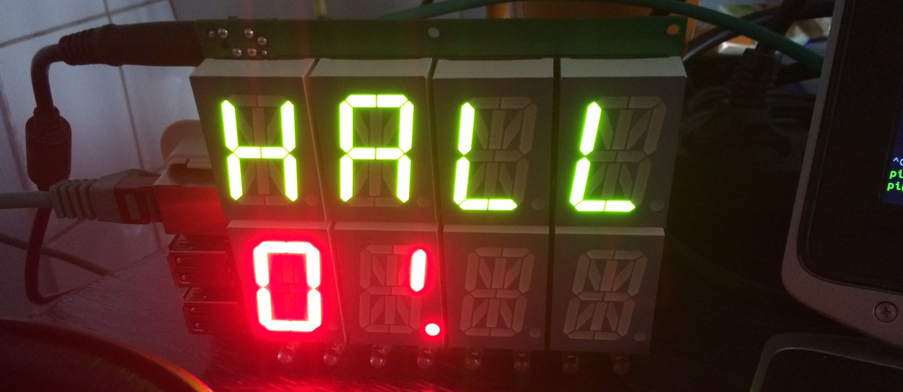
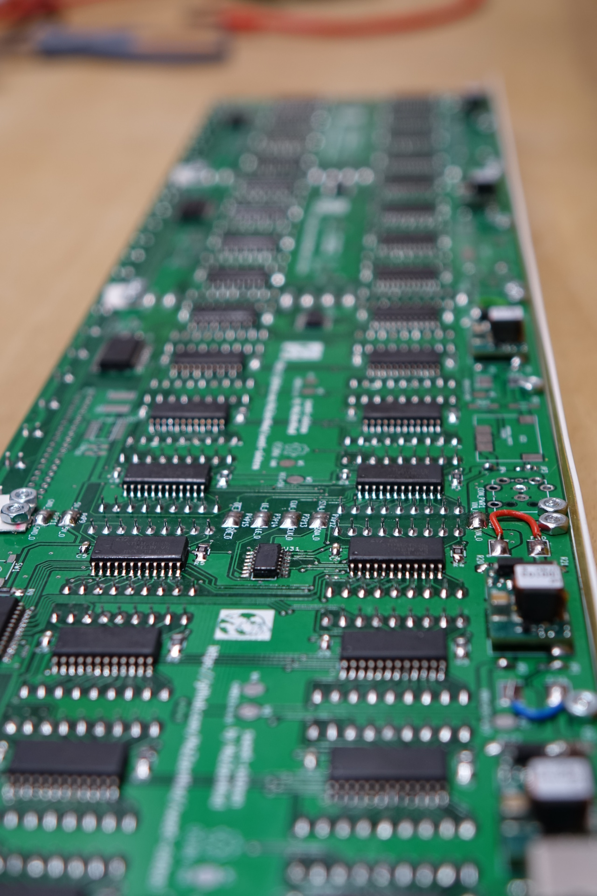
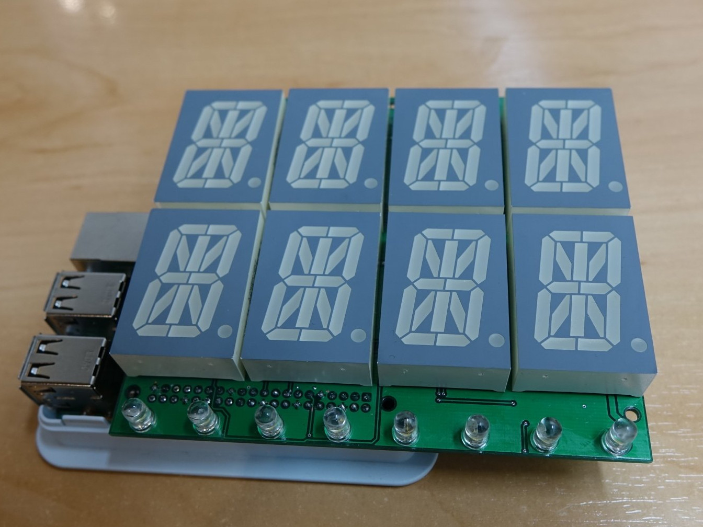
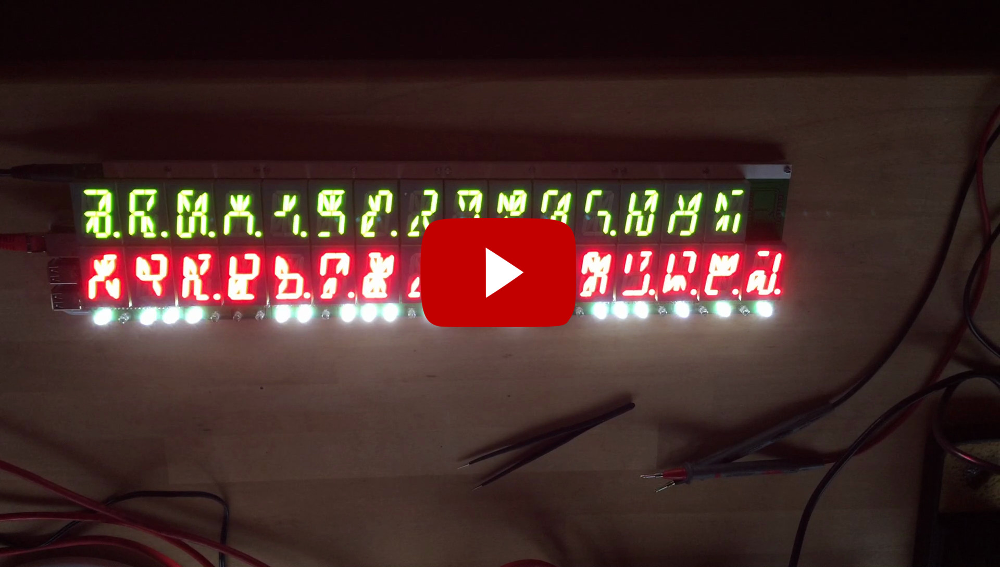
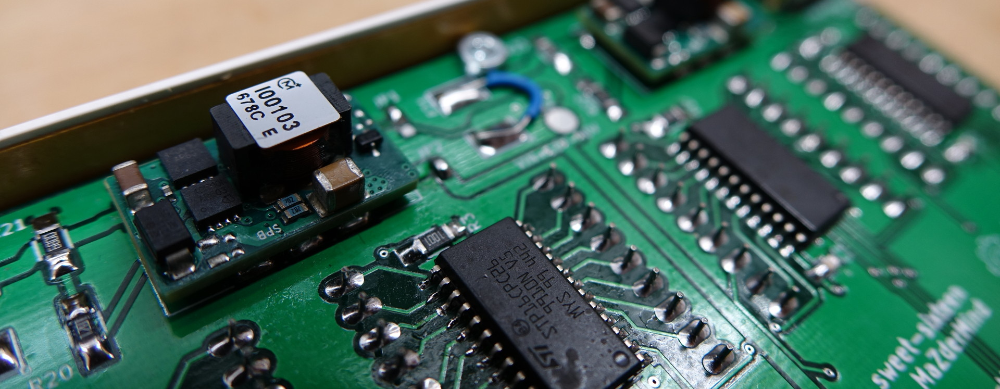
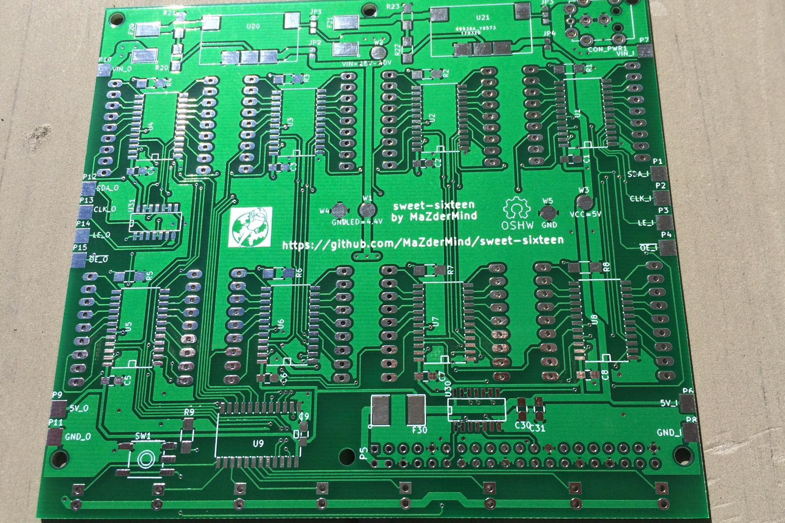
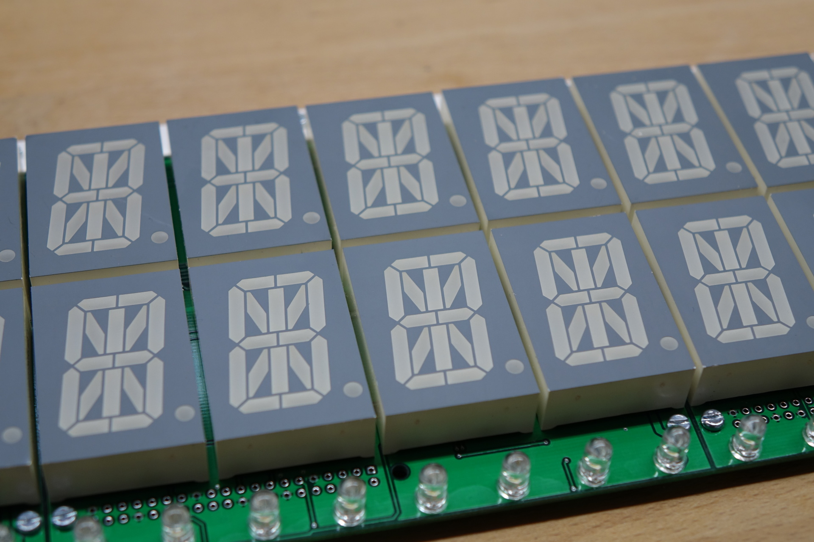

# Sweet Sixteen
> a 16x2 Characters Sixten-Segment, RaspberryPi driven Display

## Quick Links
 * <a href="Hardware/Schematic.pdf">Schematic (PDF)</a>
 * <a href="Hardware/PCB-Layout.png">PCB Layout (Image)</a>
 * <a href="Hardware/BOM.ods">BOM</a>
 * <a href="Datasheets/">Datasheets</a>
 * <a href="https://github.com/MaZderMind/sweet-sixteen-scheduler">Software</a>

## System Design

The System is built around [STP16CPC26](Datasheets/STP16CPC26.pdf) LED-Drivers in a direct drive configuration. Each LED-Driver has 16 Constant-Current sinks, each of which powers one Segment of the [PSA12-11](Datasheets/PSA12_11CGKWA.pdf) 16-Segment Displays.

The PCBs are built to be Chainable. The first Board in the Chain provides Data and the 5V Rail. It also carries the RaspberryPi "Piggy Back". The Board powers the Pi via its GPIO-Header, so there is no need to supply extra Power to the Pi (and you should not do that.)

## Signal Flow

The RaspberryPi generates Clock and Data via its Hardware-SPI Port (GPIO 10 & 11). Additionally it generates a Latch-Signal on GPIO 22 and an inverted Output-Enable Signal, which is can be used to Dim the LED-Drivers down, on one of its Hardware PWM Pins (GPIO 18).

All of these Signals are 3.3V rated. They are directly fed into a [SN74HCT08](Datasheets/sn74hct08.pdf) and-gate which is used to convert the Signals to 5V compatible swing. These Signal then go on a parallel bus to all LED-Drivers (Clock, Latch and Output-Enable) resp. to the first LED-Driver (Data).

The LED-Drivers behave like Shift-Registers on the Data-Side, so the Data-Line ist chained from the input of one LED-Driver to the next, through all 9 Drivers. Drivers 1-8 each control one of the 16 Segments of one of the 8 Digits, while the 9th Driver controls the Decimal Points of all Digits as well as the Row of the 8 LEDs on the bottom of the PCB.

The Data-Output of the last LED-Driver as well as the paralleld Bus of Clock, Latch and Output Enable are fed to another [SN74HCT08](Datasheets/sn74hct08.pdf) and-gate which is here used as a line-driver to drive the LED-Drivers on the next PCB. After the and-gate the Signal is routed to Solder-Pads on the edge of the PCB which line up with matching Pads on the opposite Edge of the next PCB.

The Signals coming from those Pads feed into the next 9 LED-Drivers, just as the Raspberry-Pi did on the first PCB. The Components needed to interface to the Raspberry-Pi (Connectors, Fuse, and-Gate and some Caps) are not fitted on the following PCBs.

## Power System

The Whole System is Powered from a Notebook-Plugpack. I chose a Dell 19V/90W Plugpack because they are quite easy to get new or used on ebay for a small amount of money everywhere on the world. I terms of Power per Euro/Dollar Notebook-Chargers are unbeatable.

The 19V (actually the Input-Rail can range from 15V to 40V DC) is fed into two DC-DC Converter Modules on the first PCB, each of which is capable of generating up to 3A.

The first DC-DC Converter generates 5V and powers the RaspberryPi as well as as all the Logic-ICs on all PCBs.
The second Converter generates a 4.4V rail used to Power the LEDs – but this time only on the first PCB.

The following PCBs accept the 5V VCC Rail generated on the first PCB as well as the input-voltage from the Plugpack, also via Pads on the Edge of the PCBs. They are only fitted with the second DC-DC Converter and generate their own 4.4V VLED Rail for their LEDS.

When all LEDs ar on, the System draws about 45W or a little more, so 60W Dell Charger should also be okay. Take a look at the [Power Calculations](Hardware/Power%20Calculations.ods) to learn how the Current is consumed and which Temperature-Rise is to expect from the LED-Drivers.

## Software

The Software that runs the Display, pulls down the latest tweets, shows what the canteen has for Lunch, Blinks when a Software-Build fails or when it's a colleagues birthday grows over on [MaZderMind/sweet-sixteen-scheduler](https://github.com/MaZderMind/sweet-sixteen-scheduler).

## Build one yourself

To build your own you need
 * some PCBs
 * some Parts
 * a RaspberryPi
 * time, patience and tools to solder the SMD-Components (which is totally doable by Hand vith a good soldering Iron)

For the PCBs you can use the [pre-generated Gerbers](Gerbers/) but *be aware* that these are the Gerbers for rev1. I fixed some Bugs in rev1 but my Display uses rev0 boards and I have *not ordered or testet* the rev1 PCBs, though I'm quite sure they will work. If you want to play save, you can Download the rev0 Gerbers from the [rev0 Release-Page](https://github.com/MaZderMind/sweet-sixteen/releases/tag/rev0).

On the other Hand you might want to design in another Power-Connector, if you don't want to use Dell Plugpacks. The Schematics and PCBs are made with [KiCad](http://kicad-pcb.org/) which is Free Software and available on all Operating Systems. For the Parts please take a look at the [BOM](Hardware/BOM.ods) which contains all Parts I used.
